# Team Journals (Skyline Cloud)


## Project Demo

Below is the link to the project recording demo.

https://drive.google.com/file/d/1c-VhpVVrTI6Xps8ZFvSpuLlA1wWFV1xf/view?usp=sharing

## Cashier's App  

1. Login 

Cashier's application is used by the Starbucks barista, a login feature is required and implmented for starbucks employees to only access to the register and order information. The login feature implemented using Spring Security dependency to secure the cashier's application.


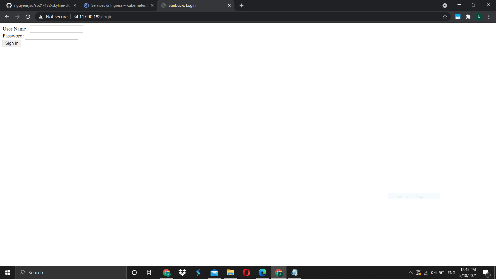


2. New Order 

The user which is the barista can also create a new order in the register when taking order from the customer. The user will have to select only one item from each section and click the submit your drink button. Once the new order is created, a order number will be generated which can be given to the customer for refernecing the order.

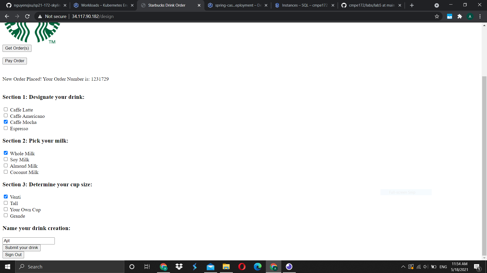

Updated MySQL Database table

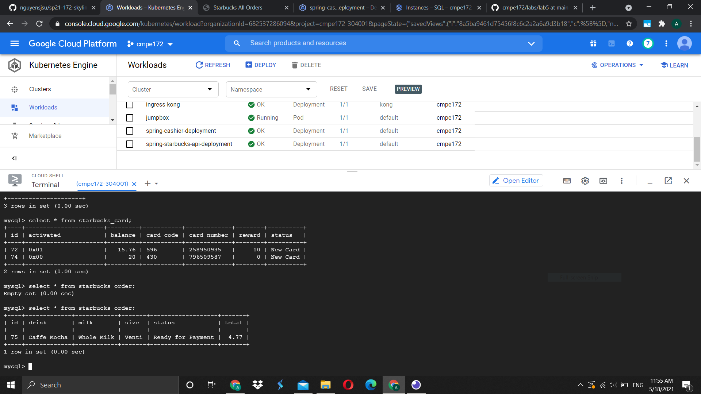

3. Get All Orders

This feature allows the user to get all the active orders in the register for payment processing. The each order will have the following details: Order number, id, drink, milk, size, total amount and status.

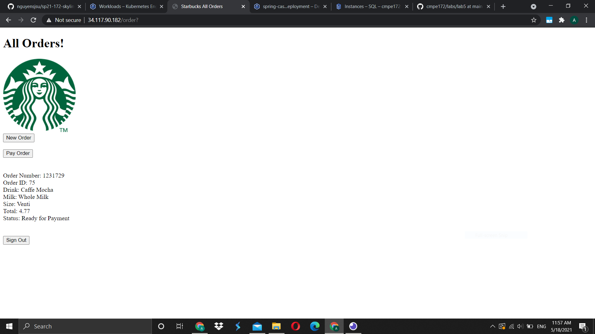


4. Pay Order

The user can navigate to the pay order page by clicking the pay order button for allowing the customer to pay for the order. This is where the user would take the details from the customer about their order and starbuck's card payment method. For the successful payment the starbucks card must be activated using the Help Desk Application. The user has to type in the name of the customer, thier order number and starbucks card for the payment. 

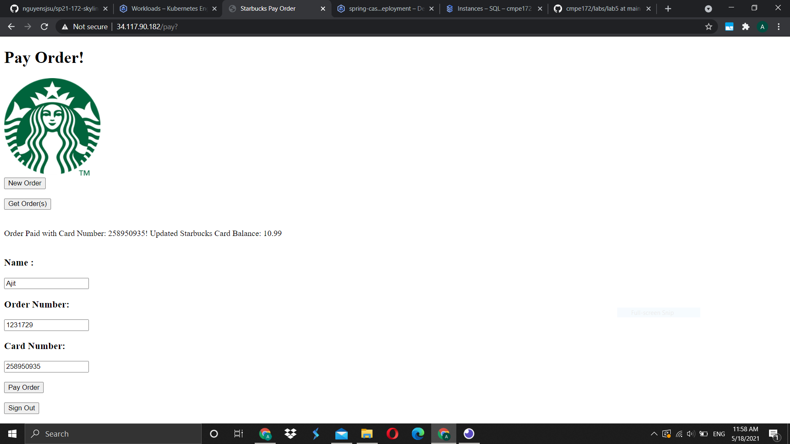

Updated order status after payment, when clicked on get all orders.

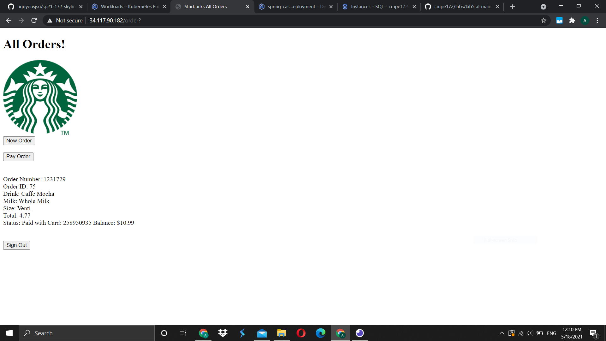

Updated MySQL Database Tables, where you can see the upadated order status, updated starbucks card balance and updated rewards.

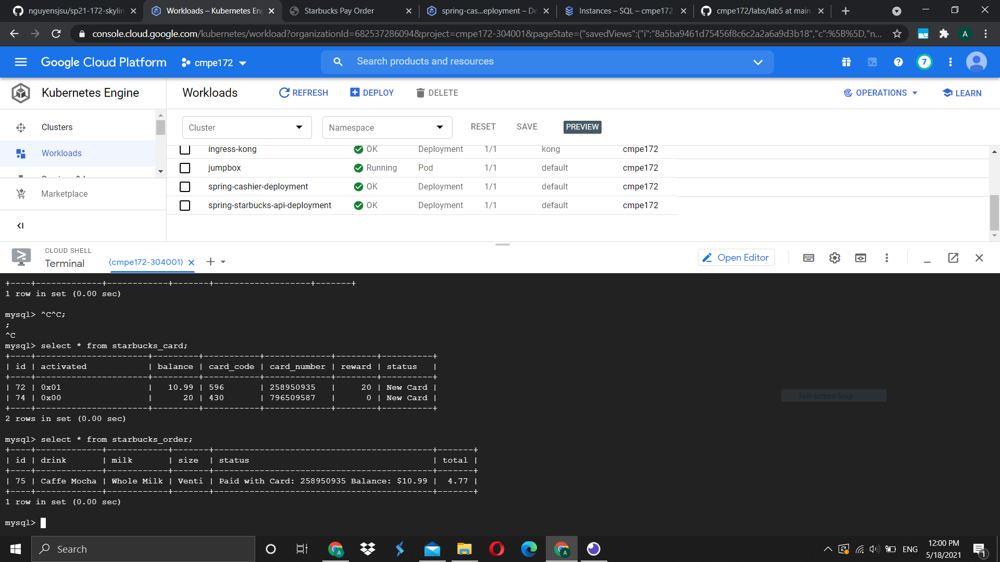

5. Sign out 

The sign out feature is implemented so only starbucks staff can use the cashier's application. A sign out button is placed on the bottom left of the page to allow users to sign out the current account. 


## Backoffice Help Desk App  
Due to only having 2 members out of 4 members for the group project. We decided that we would implement the Backoffice Help Desk App in the future if we were to continue to work on this project.  
The feature of the Backoffice Help Desk App would be to assist customer who are having problems with rewards and their Starbucks Card credits. Also would have a register feature for registering Starbucks employees working the shops like the Baristas and Managers. 

## Online Store  

1. Login 

Since the online store is used by the custemors, a login feature is required and implmented for custemors to only access to their private card information. The login feature implemented using Spring security to secure the online store application.


2. View Rewards

The feature of the online store which allows users to view their Starbucks card rewards is implemented. By selecting Reward on the navigation bar, users are navigated to the reward page where they van view the starbucks reward with corresponding card number and card code. The reward items are shown at the side. 

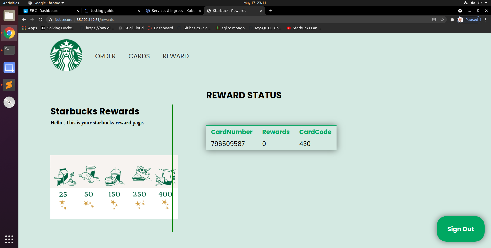


3. View Balance 

The users can also view their Starbucks card balance using the online store. When clicking Cards on the navigation bar, users can view their card balance along with the card number and card code on the card page. Additionally, an Add button is provided for users to load their starbucks card with a new credit card payment.


4. Add payment to load the Starbucks card

Users can add a new credit card payment on the card page when viewing their card balance by clicking on the Add button. After users filled the payment information, the card will be loaded with credits from the credit card.

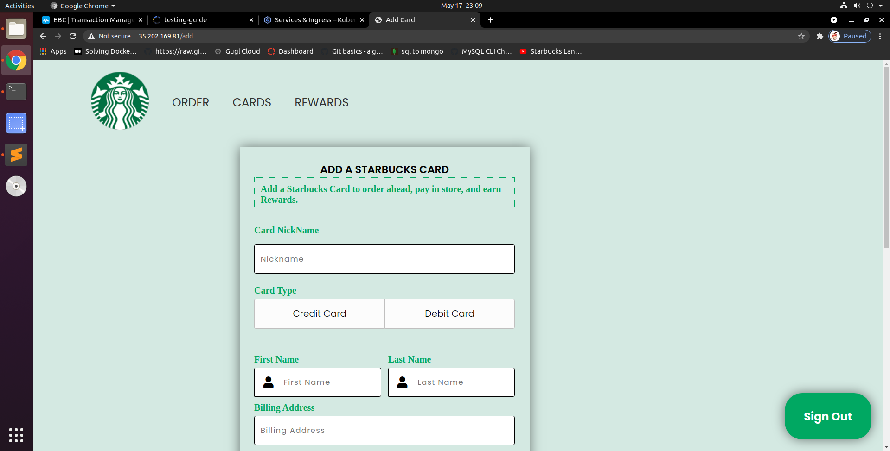


5. Sign out 

The sign out feature is implemented for users who have multiple accounts. A sign out button is placed on the right bottom corner to allow users to sign out the current account. 


## REST API  
Final design with sample request/response  
The Starbucks API Specification is as follows:

```
GET   /ping  
  Ping Health Check.  
  {  
    "Test": "Starbucks API version 1.0 alive!"  
  }   
GET   /cards 
   Get all Starbucks Cards from MySQL Database (along with balances).  
   [
      {
         "id": 42,
         "cardNumber": "419401969",
         "cardCode": "199",
         "balance": 20.0,
         "activated": false,
         "status": "New Card",
         "reward": 0
     },
     {
        "id": 43,
        "cardNumber": "607770170",
        "cardCode": "354",
        "balance": 20.0,
        "activated": false,
        "status": "New Card",
        "reward": 0
      }
    ]   
POST  /cards
    Create a new Starbucks Card.  
  {  
    "id": 58,
    "cardNumber": "261276112",
    "cardCode": "105",
    "balance": 20.0,
    "activated": false,
    "status": "New Card",
    "reward": 0
 }  
GET   /cards/{num}  
    Get the details of a specific Starbucks Card.  
 {  
    "id": 58,  
    "cardNumber": "261276112",  
    "cardCode": "105",  
    "balance": 3.59,  
    "activated": false,  
    "status": "New Card",  
    "reward": 40 
 }    
POST  /card/activate/{num}/{code}  
    Activate Card  
 {  
    "id": 58,  
    "cardNumber": "261276112",  
    "cardCode": "105",  
    "balance": 3.59,  
    "activated": true,  
    "status": "New Card",  
    "reward": 40  
 }     
POST    /order/register/{regid}  
        Create a new order. Set order as "active" for register.  
        Request:  
     {  
        "Drink": "Caffe Latte",  
        "Milk":  "Whole Milk",  
        "Size":  "Grande"  
     }            
      Response:   
     {  
       "id": 65,  
       "drink": "Caffe Latte",  
       "milk": "Whole Milk",  
       "size": "Grande",  
       "total": 3.91,  
       "status": "Ready for Payment"  
     }          
GET     /order/register/{regid}
        Request the current state of the "active" Order with a particular order number.  
   {
      "id": 3,
      "drink": "Caffe Latte",
      "milk": "Whole Milk",
      "size": "Grande",
      "total": 3.91,
      "status": "Ready for Payment"    
   }  
DELETE  /order/register/{regid}
        Clear the "active" Order with that particular order number.  
   {  
      "Status": "Active Order Cleared!"  
   }   
POST    /order/register/{regid}/pay/{cardnum}
        Process payment for the "active" Order with order number and activated Starbucks Card. 
        Response: (with updated card balance)  
    {
       "id": 1,
       "cardNumber": "573639666",
       "cardCode": "916",
       "balance": 12.18,
       "activated": true,
       "status": "New Card",
       "reward": 20    
     }
GET     /orders
        Get a list of all active orders (for all registers) 
  [   
    {
        "id": 64,
        "drink": "Caffe Latte",
        "milk": "Whole Milk",
        "size": "Venti",
        "total": 4.24,
        "status": "Paid with Card: 261276112 Balance: $3.59" 
    },  
    {  
        "id": 65,
        "drink": "Caffe Latte",
        "milk": "Whole Milk",
        "size": "Grande",
        "total": 3.91,
        "status": "Ready for Payment"
    }
  ]   
DELETE  /cards  
    Delete all Cards (Use for Unit Testing Teardown)
    {  
      "Status": "All Cards Cleared!"  
    }
DELETE  /orders  
    Delete all Orders (Use for Unit Testing Teardown)
   {
      "Status": "All Orders Cleared!"
   }
```

## Integrations  

We are using the Kong API Gateway to establish communication between clients with microservices. The Kong API Gateway helps the cashier application fetches the corresponding card information from the online store where users can manage their starbucks card. It also provide the functionality of activating a new starbuck card from the custemor to pay the orders. Our project have also used the Cybersource Payment Gateway to validate payments from clients. Each transaction will be sent to the cybersource, and once the validation is done, a payment then can be processed by the cashier application. 

## Cloud Deployments  

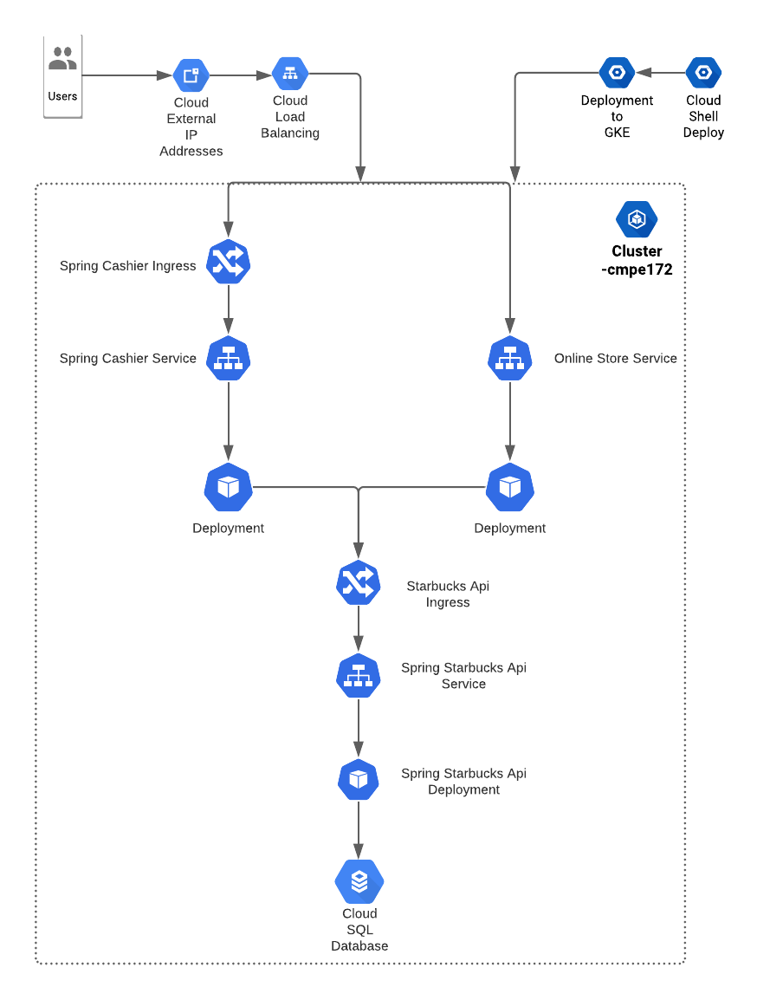

How does your Team's System Scale?  Can it handle > 1 Million Mobile Devices?  

## Technical Requirements  
Discussion with screenshot evidence of how each technical requirement is meet.  

---

### Online Store Application

### 1. Deployment to GKE

Deployment step by step:  

* Deployed spring-starbucks-api-deployment to GKE using deployment.yaml in starbucks-api/gcp_deployment folder and before that pushed the starbucks-api:v3 docker image to Docker Hub.
* Created a Service for Starbucks API called spring-starbucks-api-service from service.yaml in the starbucks-api/gcp_deployment folder.
* Testing the reachability from GKE Jumbox Pod of the starbucks-api-service
* Apply Kong GKE Ingress Controller
* Setting PROXY_IP to Kong's Public IP and testing Kong via Proxy IP
* Created an Ingress rule to proxy the starbucks-api-service
* Testing Kong API Ping Endpoint
* Add Kong Key-Auth PlugIn
* Configure an API Client Key and apply API Key Credentials to API Client using the created Kubernetes Secret Key.
* Deployed spring-cashier-deployment to GKE using deployment.yaml in the spring-cashier folder and before that pushed the spring-cashier:v1 docker image to Docker Hub.
* Created a Service called spring-cashier-service using service.yaml in the spring-cashier folder.
* Created an ingress so the spring-cashier application can be accessed on the web.

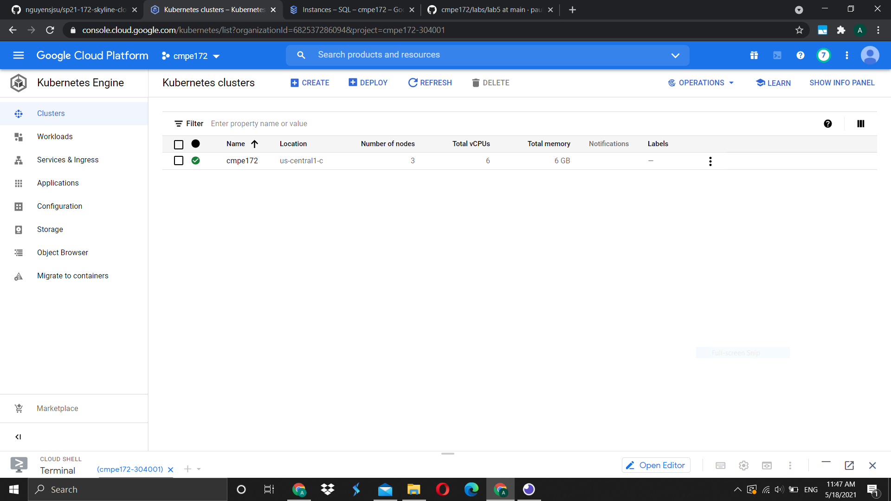

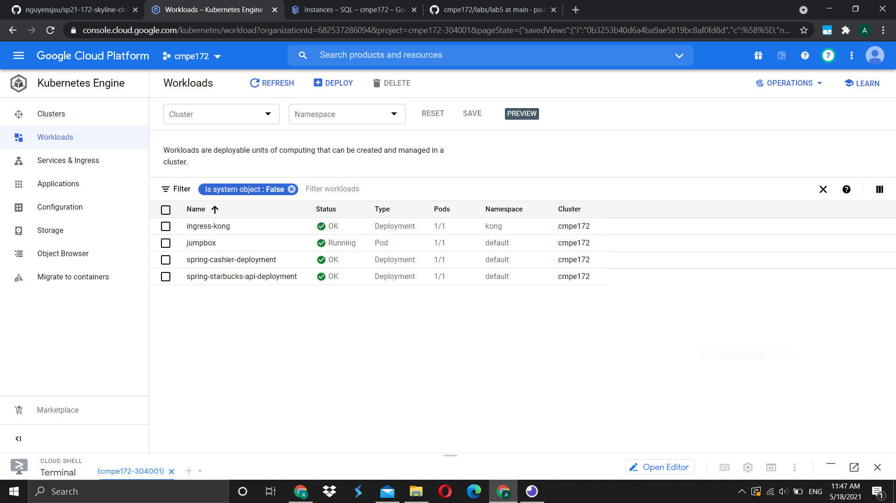 

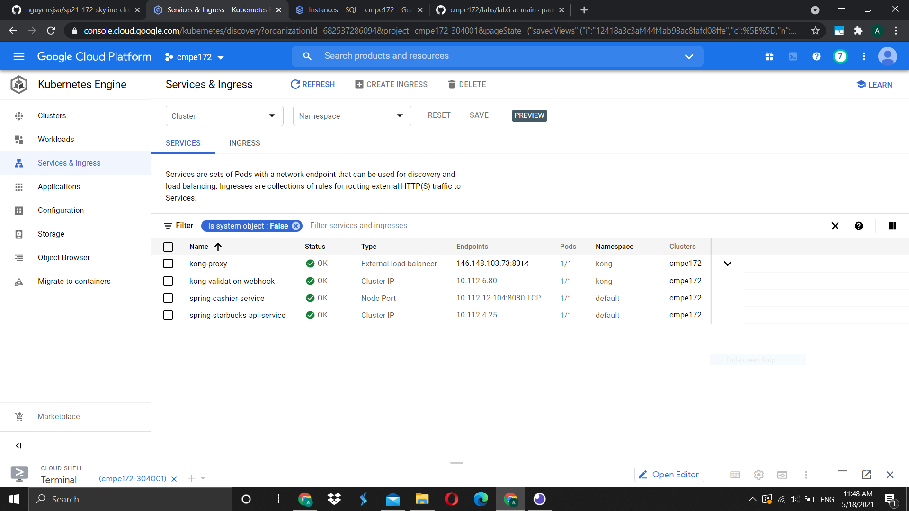

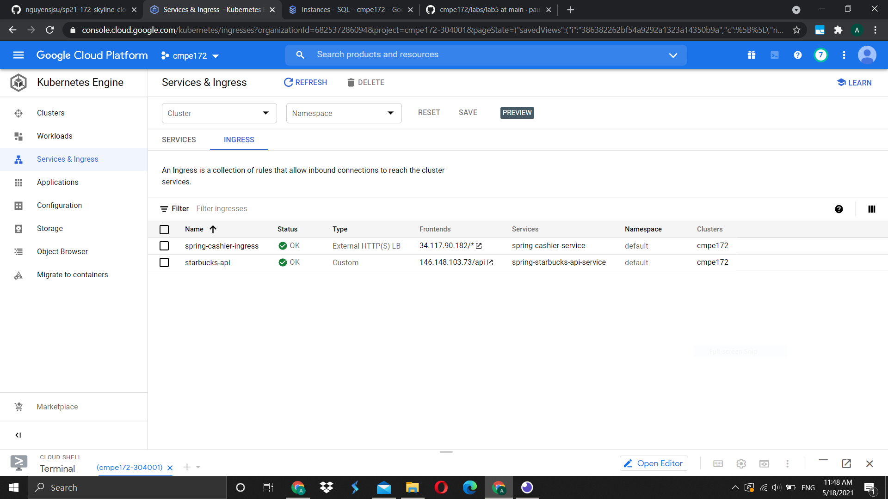
  
We deploy the docker image of the online store application to GKE to create a loadbalancer. 


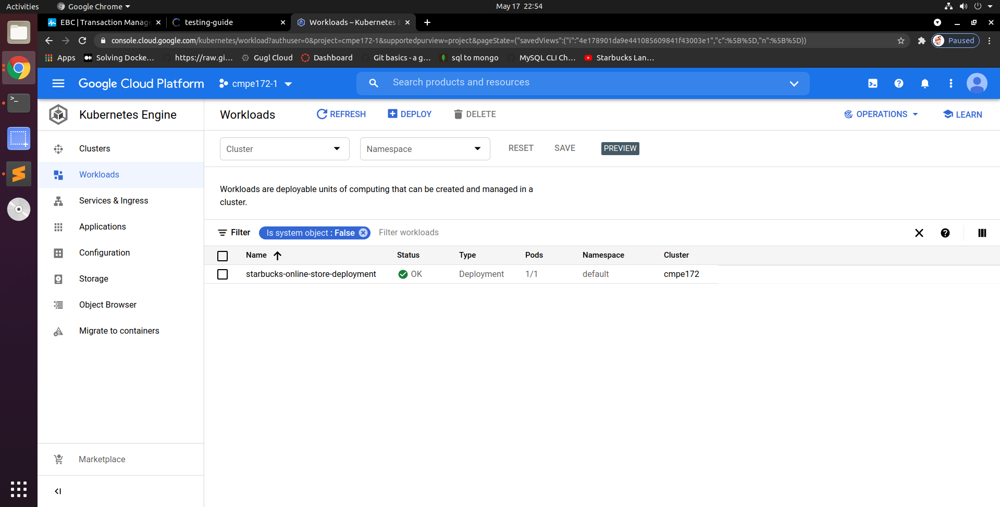


Creating a Cloud SQL MySQL Instance with specification listed below.
* Instance ID:  starbucks-db
* Password:     cmpe172starbucks
* Version:      MySQL 8.0
* Region:       Any
* Zone:         Single Zone
* Machine Type: Lightweight
* Storage:      SSD / 35 GB
* Connections:  Private IP
* Network:      default (VPC Native)
  - May require setting up a private service connnection
  - 1. Enable Service Networking API
  - 2. Use Automatic IP Range

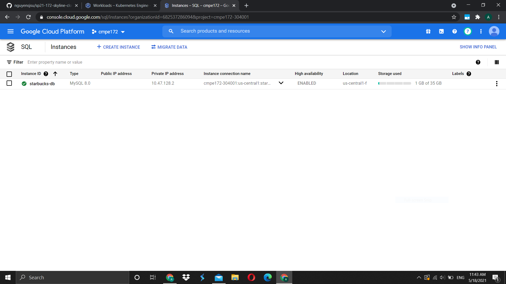

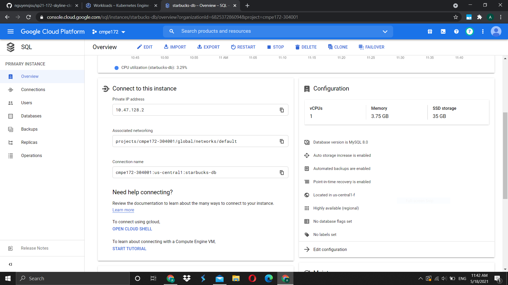

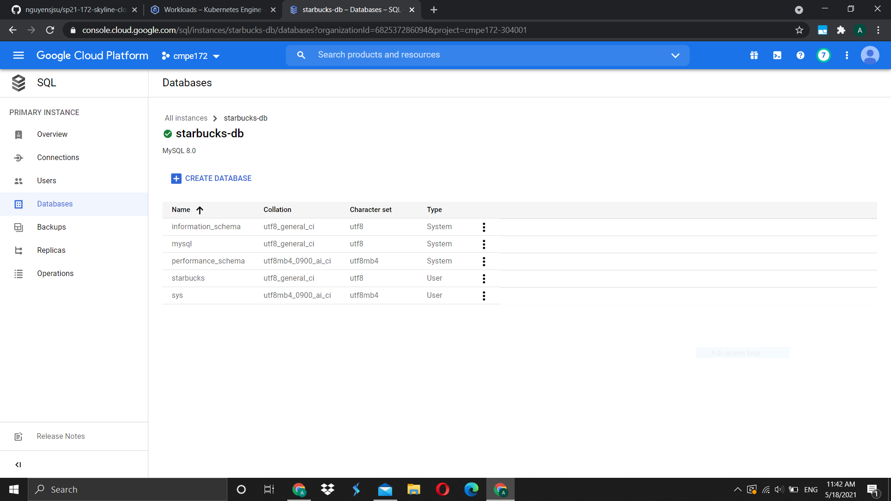

Testing the reachability from GKE Jumbox Pod of the Cloud SQL starbucks-db Instance.

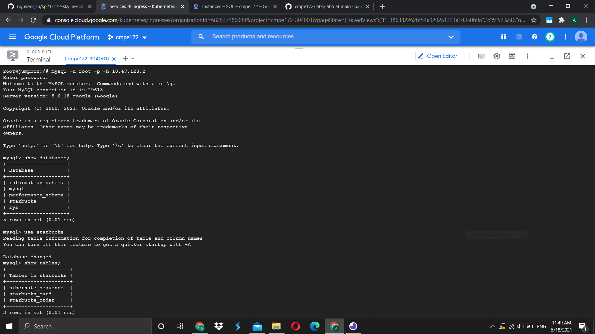


### 2. Spring Security 

#### Online Store  
We use the spring security to implment the login and sign out functionalities to secure the application. Only with valid user name and password can allow a user to mange their starbucks card.


#### Cashier Application  
We used Spring Security to implement the login and logout functionalities for the security ascept and also that only authorized users can access the application which are the Stabucks store staff.

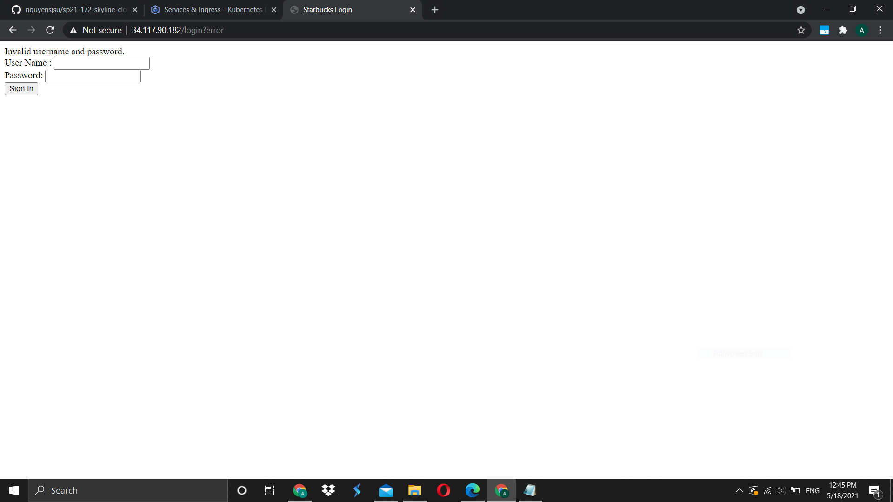


### 3. Cybersource Payment Portal

The cybersource payment gateway is to validate the transaction made by custemors when they want to load credits to their starbucks card. If the validation go through, credits will be loaded to the starbucks card.

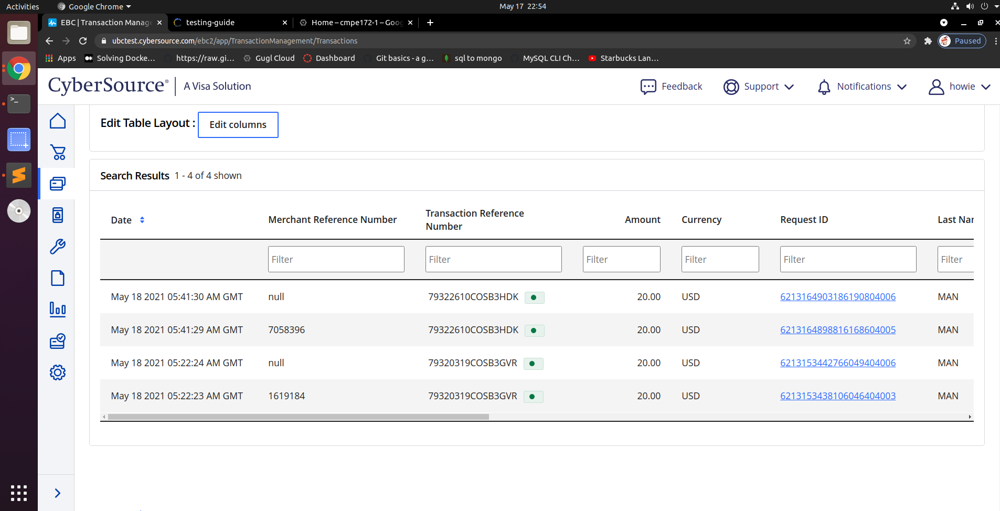

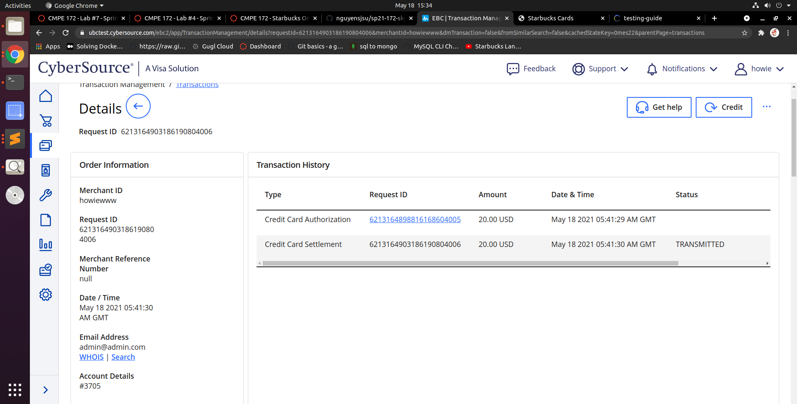


### 4. Kong API Authentication Testing

For testing the API, I added the "apikey" as the header and header value as "Zkfokey2311" for API Key Authentication when testing the API in insomnia.

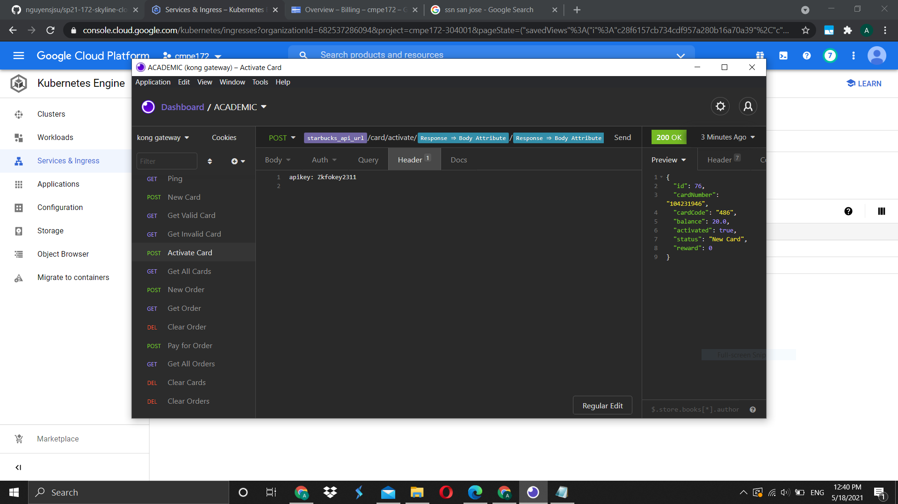

If we try to consume the starbucks-api without the API Key in the header then we would get a 401 Unauthorized response status code shown in the below screenshot.

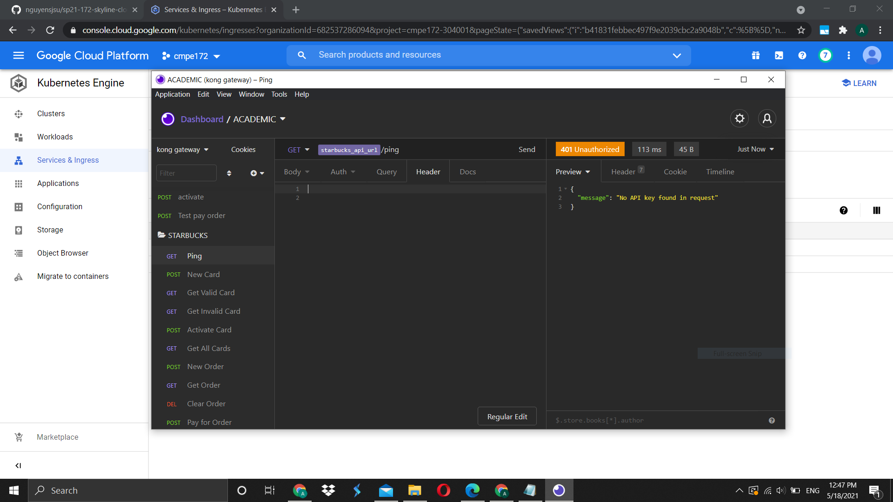


## Challenges
