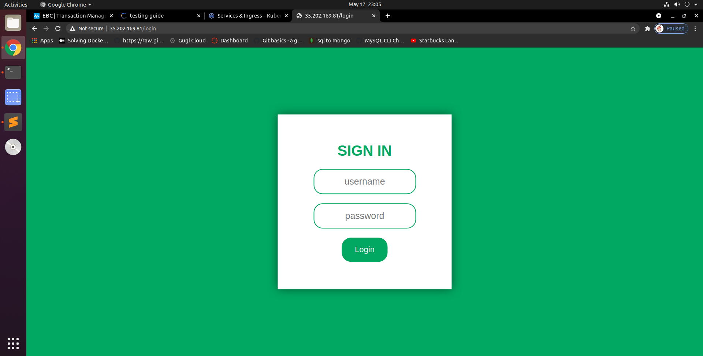
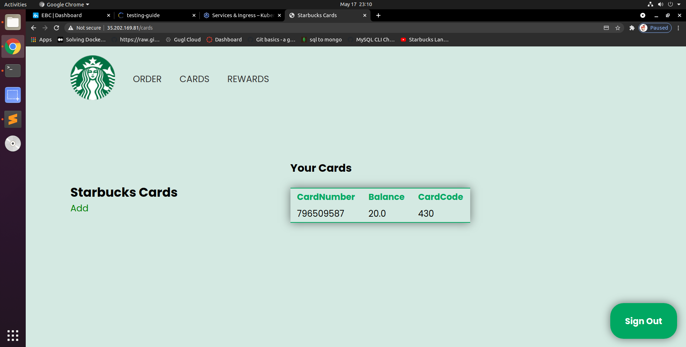
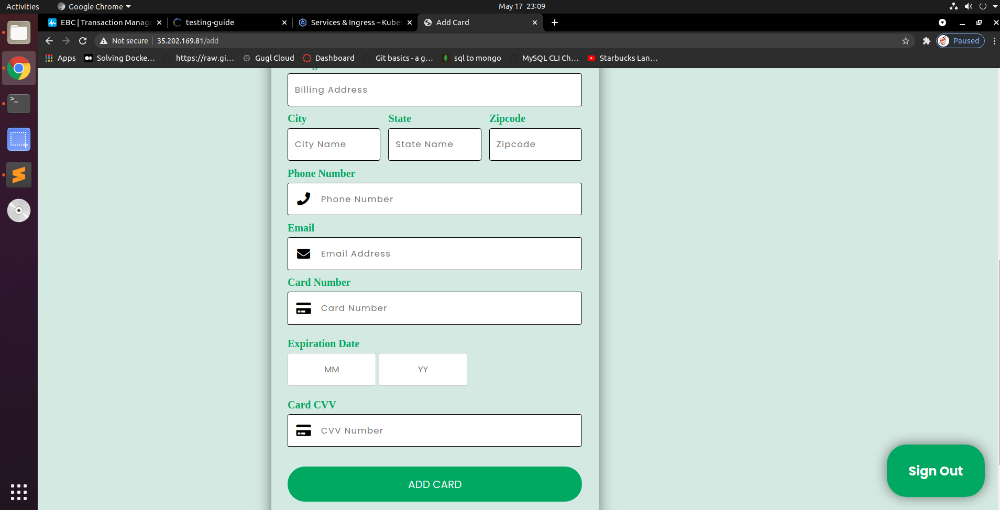
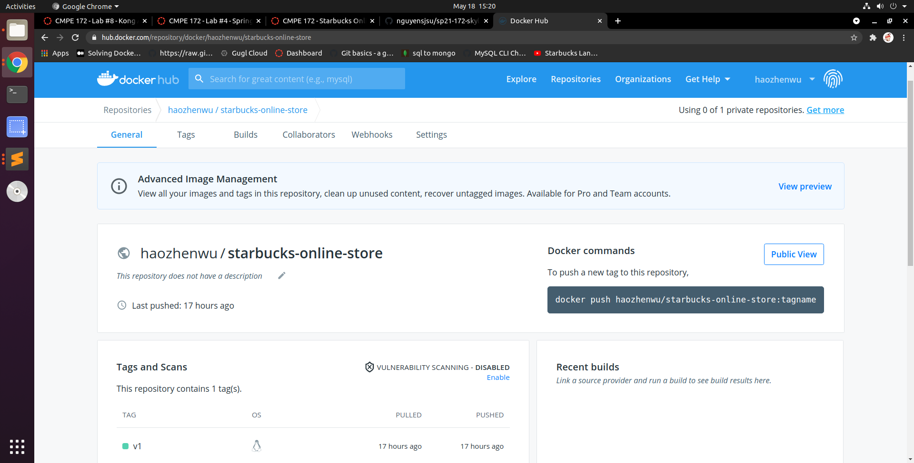
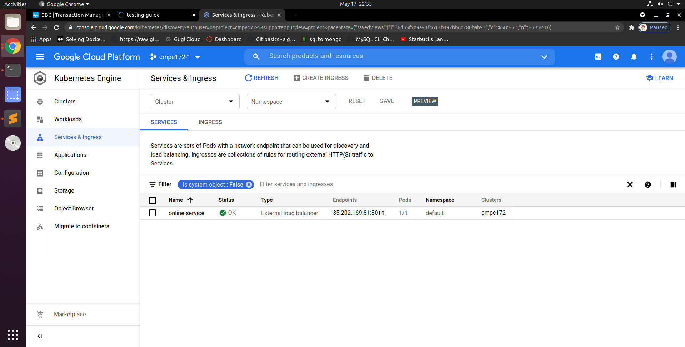
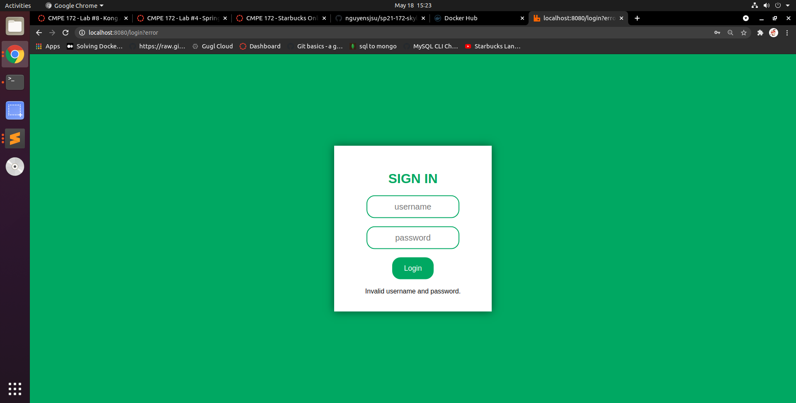
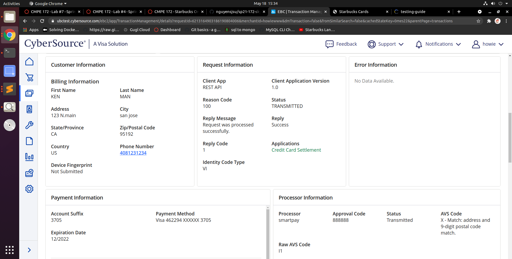

# Team Journals (Skyline Cloud)

Team Journalss should include
* Overall Architecture Diagram of your Cloud Deployment  

A section for each of the following discussion the features implemented  


## Project Demo Link

Below is the share link to the google drive recording demo of our project application.

https://drive.google.com/file/d/1c-VhpVVrTI6Xps8ZFvSpuLlA1wWFV1xf/view?usp=sharing


## Cashier's App  
What features were implemented? 

## Backoffice Help Desk App  
Due to only having 2 members out of 4 members for the group project. We decided that we would implement the Backoffice Help Desk App in the future if we were to continue to work on this project.  
The feature of the Backoffice Help Desk App would be to assist customer who are having problems with rewards and their Starbucks Card credits. Also would have a register feature for registering Starbucks employees working the shops like the Baristas and Managers. 

## Online Store  

1. Login 

Since the online store is used by the custemors, a login feature is required and implmented for custemors to only access to their private card information. The login feature implemented using Spring security to secure the online store application.





2. View Rewards

The feature of the online store which allows users to view their Starbucks card rewards is implemented. By selecting Reward on the navigation bar, users are navigated to the reward page where they van view the starbucks reward with corresponding card number and card code. The reward items are shown at the side. 


3. View Balance 

The users can also view their Starbucks card balance using the online store. When clicking Cards on the navigation bar, users can view their card balance along with the card number and card code on the card page. Additionally, an Add button is provided for users to load their starbucks card with a new credit card payment.



4. Add payment to load the Starbucks card

Users can add a new credit card payment on the card page when viewing their card balance by clicking on the Add button. After users filled the payment information, the card will be loaded with credits from the credit card.




5. Sign out 

The sign out feature is implemented for users who have multiple accounts. A sign out button is placed on the right bottom corner to allow users to sign out the current account. 


## REST API  
Final design with sample request/response  
The Starbucks API Specification is as follows:

```
GET 	/ping  
  Ping Health Check.  
  {  
    "Test": "Starbucks API version 1.0 alive!"  
  }		
GET 	/cards 
   Get all Starbucks Cards from MySQL Database (along with balances).  
   [
      {
         "id": 42,
         "cardNumber": "419401969",
         "cardCode": "199",
         "balance": 20.0,
         "activated": false,
         "status": "New Card",
         "reward": 0
     },
     {
        "id": 43,
        "cardNumber": "607770170",
        "cardCode": "354",
        "balance": 20.0,
        "activated": false,
        "status": "New Card",
        "reward": 0
      }
    ]		
POST 	/cards
		Create a new Starbucks Card.  
  {  
    "id": 58,
    "cardNumber": "261276112",
    "cardCode": "105",
    "balance": 20.0,
    "activated": false,
    "status": "New Card",
    "reward": 0
 }  
GET 	/cards/{num}  
		Get the details of a specific Starbucks Card.  
 {  
    "id": 58,  
    "cardNumber": "261276112",  
    "cardCode": "105",  
    "balance": 3.59,  
    "activated": false,  
    "status": "New Card",  
    "reward": 40 
 }		
POST 	/card/activate/{num}/{code}  
		Activate Card  
 {  
    "id": 58,  
    "cardNumber": "261276112",  
    "cardCode": "105",  
    "balance": 3.59,  
    "activated": true,  
    "status": "New Card",  
    "reward": 40  
 }     
POST    /order/register/{regid}  
        Create a new order. Set order as "active" for register.  
        Request:  
     {  
	      "Drink": "Caffe Latte",  
	      "Milk":  "Whole Milk",  
	      "Size":  "Grande"  
     }            
	    Response:   
     {  
       "id": 65,  
       "drink": "Caffe Latte",  
       "milk": "Whole Milk",  
       "size": "Grande",  
       "total": 3.91,  
       "status": "Ready for Payment"  
     }    	    
GET     /order/register/{regid}
        Request the current state of the "active" Order with a particular order number.  
   {
      "id": 3,
      "drink": "Caffe Latte",
      "milk": "Whole Milk",
      "size": "Grande",
      "total": 3.91,
      "status": "Ready for Payment"    
   }  
DELETE  /order/register/{regid}
        Clear the "active" Order with that particular order number.  
   {  
		  "Status": "Active Order Cleared!"  
   }   
POST    /order/register/{regid}/pay/{cardnum}
        Process payment for the "active" Order with order number and activated Starbucks Card. 
        Response: (with updated card balance)  
    {
       "id": 1,
       "cardNumber": "573639666",
       "cardCode": "916",
       "balance": 12.18,
       "activated": true,
       "status": "New Card",
       "reward": 20    
     }
GET     /orders
        Get a list of all active orders (for all registers) 
  [   
    {
        "id": 64,
        "drink": "Caffe Latte",
        "milk": "Whole Milk",
        "size": "Venti",
        "total": 4.24,
        "status": "Paid with Card: 261276112 Balance: $3.59" 
    },  
    {  
        "id": 65,
        "drink": "Caffe Latte",
        "milk": "Whole Milk",
        "size": "Grande",
        "total": 3.91,
        "status": "Ready for Payment"
    }
  ]   
DELETE 	/cards  
    Delete all Cards (Use for Unit Testing Teardown)
    {  
      "Status": "All Cards Cleared!"  
    }
DELETE 	/orders  
    Delete all Orders (Use for Unit Testing Teardown)
   {
      "Status": "All Orders Cleared!"
   }
```

## Integrations  

We are using the Kong API Gateway to establish communication between clients with microservices. The Kong API Gateway helps the cashier application fetches the corresponding card information from the online store where users can manage their starbucks card. It also provide the functionality of activating a new starbuck card from the custemor to pay the orders. Our project have also used the Cybersource Payment Gateway to validate payments from clients. Each transaction will be sent to the cybersource, and once the validation is done, a payment then can be processed by the cashier application. 

## Cloud Deployments  


How does your Team's System Scale?  Can it handle > 1 Million Mobile Devices?  

## Technical Requirements  
Discussion with screenshot evidence of how each technical requirement is meet.  

---

### Online Store Application

1. Deployment to GKE

We deploy the docker image of the online store application to GKE to create a loadbalancer. 






2. Spring Security 

We use the spring security to implment the login and sign out functionalities to secure the application. Only with valid user name and password can allow a user to mange their starbucks card.




3. Cybersource Payment Gateway

The cybersource payment gateway is to validate the transaction made by custemors when they want to load credits to their starbucks card. If the validation go through, credits will be loaded to the starbucks card.





## Challenges

